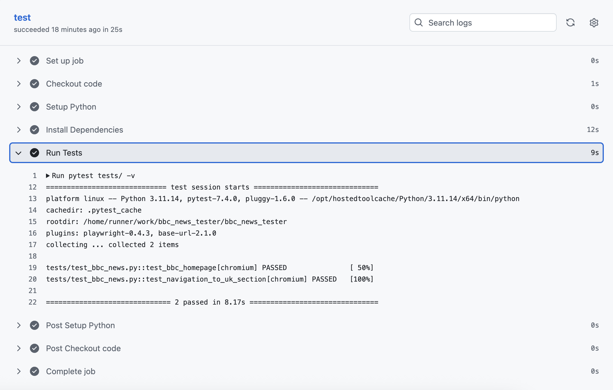

# BBC News Smoke Tests

Automated smoke tests for BBC News using Playwright and GitHub Actions.

## 🎯 Purpose
This project demonstrates automated testing of a live news website, verifying:
- Homepage loads correctly
- UK section is accessible
- Core content is visible

## 📸 Test Results



*All tests passing in GitHub Actions*

## 🛠️ Tech Stack
- **Playwright** - Browser automation
- **Python/pytest** - Test framework
- **GitHub Actions** - CI/CD pipeline

## 🚀 Quick Start
```bash
# Clone the repository
git clone https://github.com/laurieveitch/bbc_news_tester
cd bbc_news_tester

# Install dependencies
pip install -r requirements.txt
playwright install chromium

# Run tests
pytest tests/ -v --headed
```